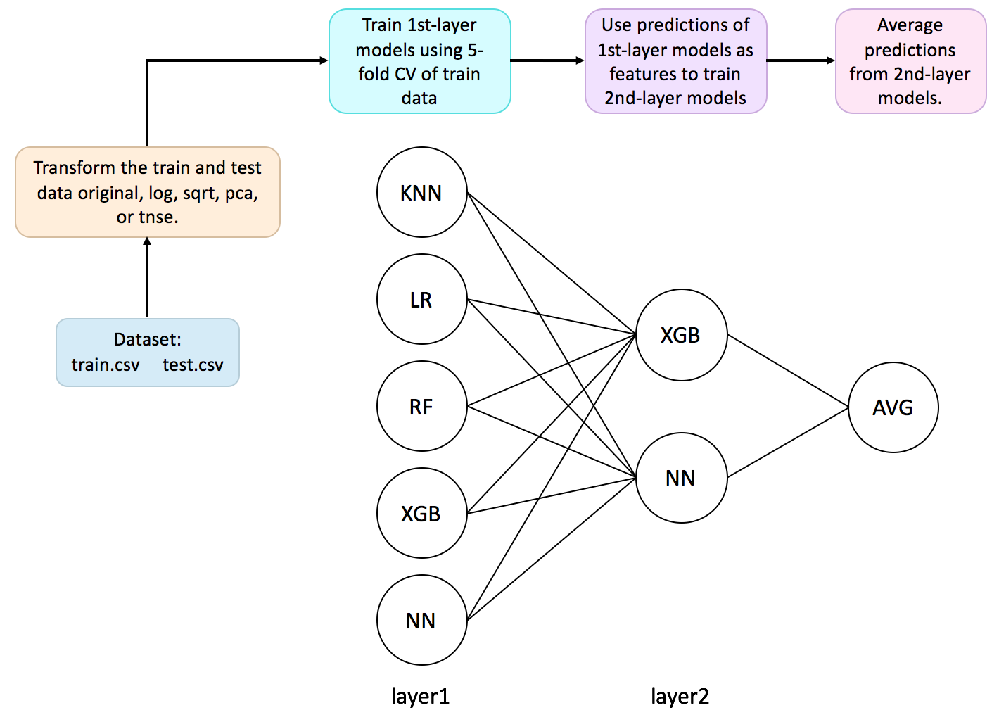

# kaggle-otto-classification
My solution to [Otto Group Product Classification Challenge](https://www.kaggle.com/c/otto-group-product-classification-challenge) (Top 4%, 107th of 3514).

## Overview

My solution is a 2-layer stacking classifier that ensembles multiple machine learning algorithms, including **k-Nearest Neighbors (kNN)**, **Logistic Regression (LR)**, **Random Forest (RF)**, **Gradient Boosting Classifier (XGB)**, and **Neural
Networks (NN)**.The model achieved 82.4% accuracy rate in the test dataset.
 

## Running
`python ensemble_train.py`

Prediction will be saved as `submission_DATETIME.csv`.
## Requirements
### Dataset
[Otto group product classification dataset](https://www.kaggle.com/c/otto-group-product-classification-challenge/data) - put `train.csv` and `test.csv` in the top level of this repository.
### Dependencies
Install Python dependencies using `pip install -r requirements.txt`.